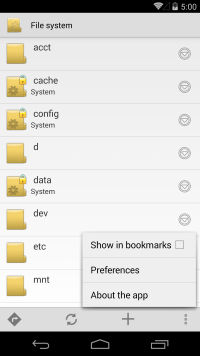
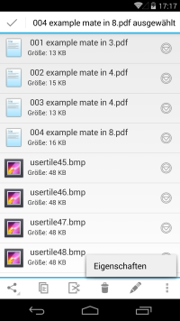

<h1>FileExplorer</h1>
Deutsch weiter unten! 

 

A light weighted file explorer/manager for your Android device. 
You can build it with AndroidStudio or find the APK in the app folder. 
 
The project has been cloned from github.com/ameyms/android-file-explorer. 
 
 
<h1>FileExplorer</h1>

 

Ein leichtgewichtiger Dateimanager f&uuml;r Android 
Sie k&ouml;nnen das Projekt mit AndroidStudio &uuml;bersetzen, oder aber die APK im app-Ordner finden. 
 
Das Projekt wurde geklont von github.com/ameyms/android-file-explorer. 
